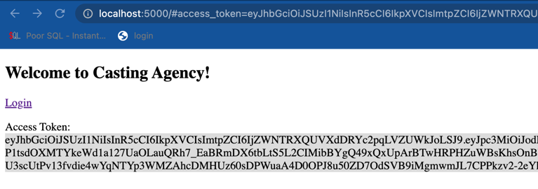
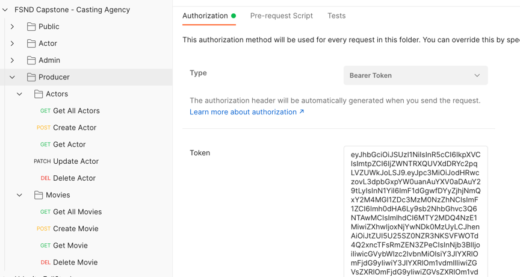

# udacity-fsnd-casting-agency

## Role
- Casting Assistant 
  - Can view actors and movies
- Casting Director 
  - All permissions a Casting Assistant has and… 
  - Add or delete an actor from the database 
  - Modify actors or movies
- Executive Producer 
  - All permissions a Casting Director has and… 
  - Add or delete a movie from the database

## Testing domain
https://william-casting-agency.herokuapp.com/

## Testing accounts
- Producer:
```buildoutcfg
producer@udacity.com
Strong@Password123
```
- Director:
```buildoutcfg
director@udacity.com
Strong@Password123
```
- Assistant: 
```buildoutcfg
assistant@udacity.com
Strong@Password123
```
### How to get a new access token?
- Login via UI: /login

- Get Access token printed on the UI



- Copy the token into Postman folder corresponding to the role



## Setup Environment
```buildoutcfg
# You should have setup.sh and requirements.txt available
chmod +x setup.sh
source setup.sh
```

## Setup DB
### Create DB
```buildoutcfg
$ sudo -u <os_username> -i
$ createdb <db-name>
$ exit
```
### Install and run Postgres
```buildoutcfg
# Mac/Linux
# Install Postgres using Brew. Reference: https://wiki.postgresql.org/wiki/Homebrew 
$ brew install postgresql
# Verify the installation
$ postgres --version
postgres (PostgreSQL) 14.2
# Get the Postgres location
$ which postgres
/opt/homebrew/bin/postgres

$ pg_ctl -D /opt/homebrew/var/postgres start
waiting for server to start....2022-08-13 16:12:05.425 +07 [15137] LOG:  starting PostgreSQL 14.2 on aarch64-apple-darwin21.3.0, compiled by Apple clang version 13.0.0 (clang-1300.0.29.30), 64-bit
2022-08-13 16:12:05.426 +07 [15137] LOG:  listening on IPv4 address "127.0.0.1", port 5432
2022-08-13 16:12:05.426 +07 [15137] LOG:  listening on IPv6 address "::1", port 5432
2022-08-13 16:12:05.427 +07 [15137] LOG:  listening on Unix socket "/tmp/.s.PGSQL.5432"
2022-08-13 16:12:05.440 +07 [15138] LOG:  database system was shut down at 2022-08-13 16:12:00 +07
2022-08-13 16:12:05.446 +07 [15137] LOG:  database system is ready to accept connections
 done
server started

$ pg_ctl -D /opt/homebrew/var/postgres stop
```

- Verify the database
```buildoutcfg
# Open psql prompt
ex. psql <db-name>
# View the available roles
\du
# View databases
\list
```

### Migrate DB
```buildoutcfg
$ python manage.py db init
$ python manage.py db migrate
$ python manage.py db upgrade
```

## Deploying to Heroku Cloud
### Create an App
```buildoutcfg
heroku create [my-app-name] --buildpack heroku/python
# For example, 
# heroku create myapp-663697908 --buildpack heroku/python
# https://myapp-663697908.herokuapp.com/ | https://git.heroku.com/myapp-663697908.git
```

### Add PostgresSQL addon for our database
```buildoutcfg
$ heroku addons:create heroku-postgresql:hobby-dev --app [my-app-name]
# hobby-dev is the free tier version of addon heroku-postgresql
```
```buildoutcfg
# Config the app with new heroku DATABASE_URL
$ heroku config --app william-casting-agency 
```

### Push changes into heroku
```buildoutcfg
# Every time you make any edits to any file in the web_app folder
# Check which files are ready to be committed
git add -A
git status
git commit -m "your message"
```
```buildoutcfg
# Assuming you have already committed all your local edits.
git push heroku HEAD:master
```

```buildoutcfg
# Debugging on heroku
heroku logs --tail
```

### Migrate the database
```buildoutcfg
$ heroku run python manage.py db upgrade --app [my-app-name]
```

## Setup Auth0 Authorization
Ref: https://auth0.com/docs/api/authentication#authorization-code-flow
